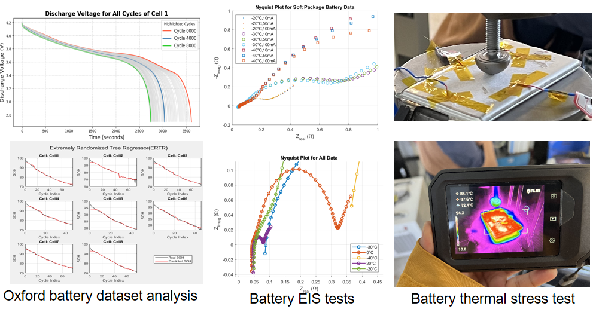
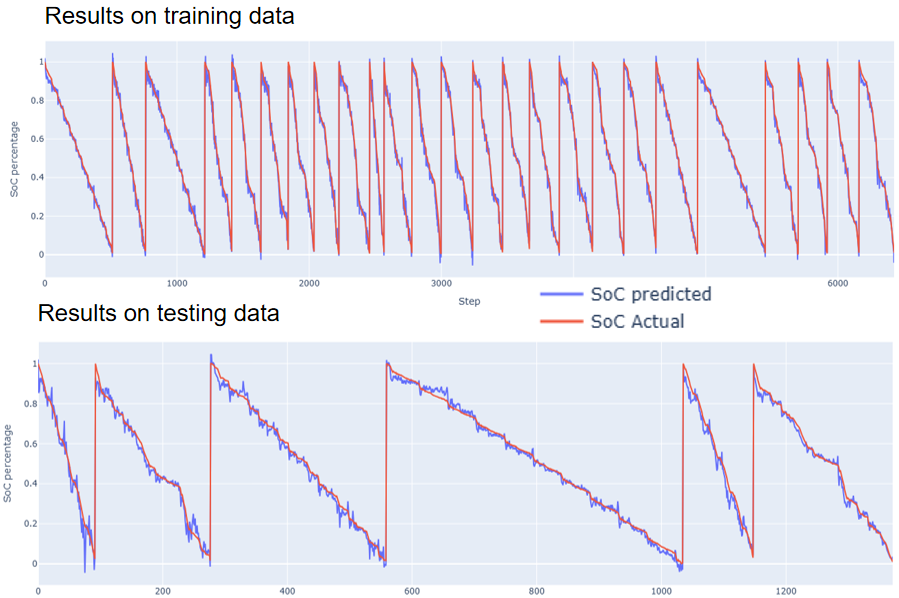
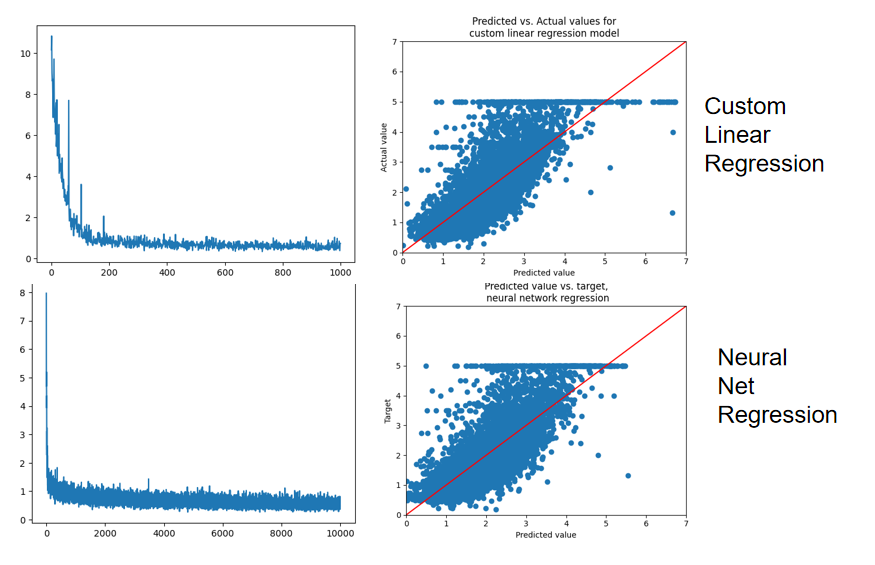
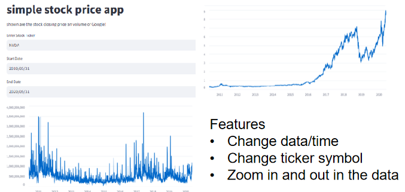
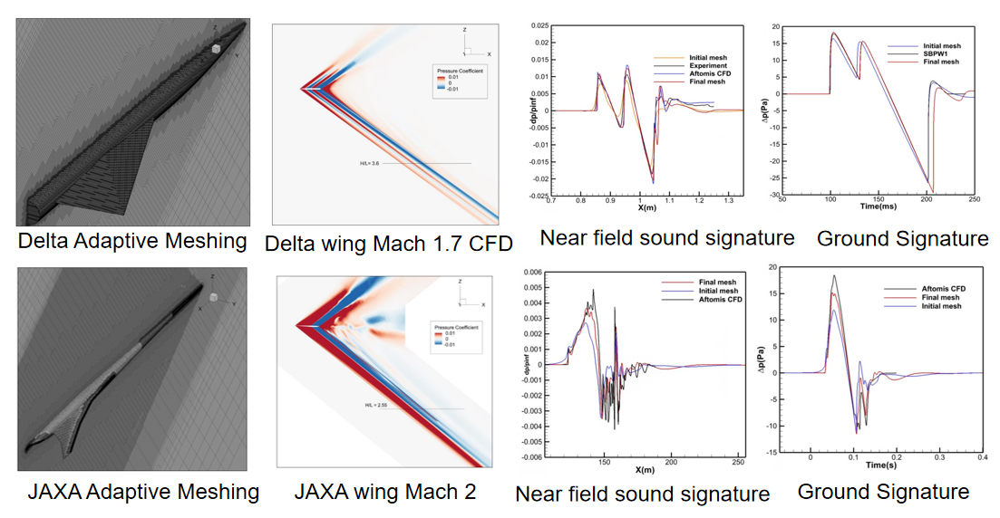
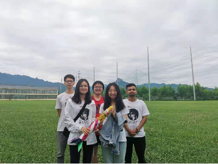
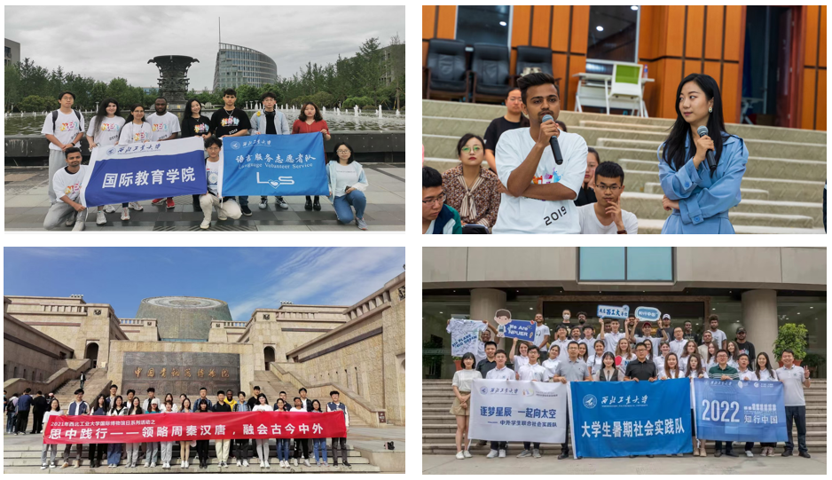
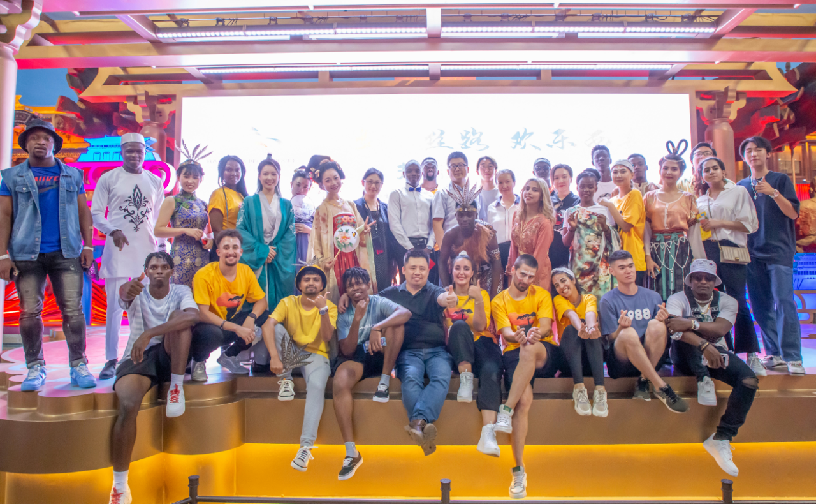
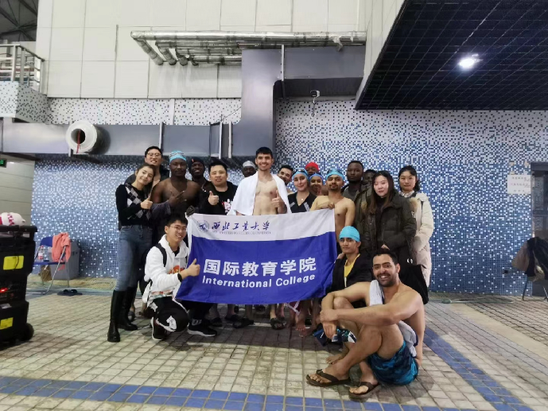
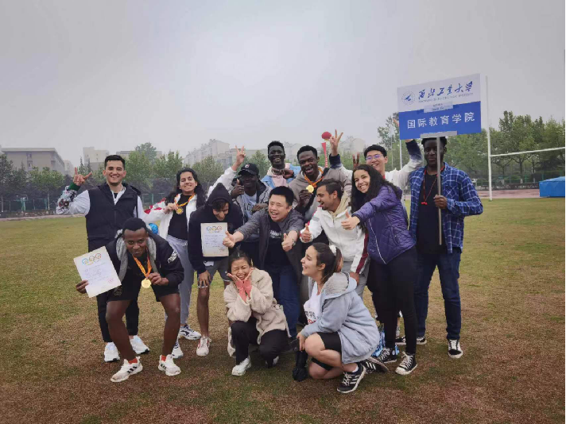

# Welcome to my portfolio!

## Graduate Projects

### <ins>Master's Thesis</ins>: *"State parameter estimation of Li-ion battery using Deep Neural Networks and Equivalent circuit model"*  

_Key Skills: Python (PyTorch, scikit-learn, fastai, PyBamm), `Matlab and Simulink, Battery modelling, Battery testing, BMS_

With the comprehensive review of <b>Battery Management System(BMS) and various battery modeling techniques</b>, it is evident that
the BMS plays a crucial role in enhancing battery performance, extending lifespan, and ensuring protection against damage.  
Among the different modeling approaches, the <b>Equivalent Circuit Model (ECM)</b> is the most widely used due to its simplicity and effectiveness.
On the other hand, the <b>Electrochemical Model</b> provides highly accurate state predictions by incorporating detailed 
internal cell parameters, but it requires significant computational resources and is challenging to implement.  

The <b>Data-Driven Modeling Approach</b>, often referred to as a <b>"black-box model,"</b> has shown promising results.
 It is relatively easy to set up but heavily relies on high-quality experimental training data. 
 Therefore, extensive testing, such as <b>battery cycling</b> and <b>Electrochemical Impedance Spectroscopy (EIS)</b>,
 is necessary to develop reliable models for commercial<b>Lithium-ion Batteries</b>. 
Developing an accurate <b>Data-Driven Battery Model</b> using <b>python(PyBamm, PyTorch, fastai)</b> and implementing it in the <b>MATLAB/Simulink</b> environment for 
<b>Electric Vehicle (EV) simulations</b>, considering various driving profiles and ambient temperature conditions.

 

### Lithium ion battery State of Charge estimation using Bidirectional Long Short Term Memory(BiLSTM)

_Key Skills: Python (numpy, pandas, matplotlib, tensorflow, seaborn), time series forecasting_ 

This project uses dataset of 3Ah LG HG2 battery cell tested in various test conditions and temperature. Sequential model from tensorflow with <b>input layer, bidirectionaLSTM layer and three forward layers with selu activation function and an output layer with linear activation function.</b> The model is trained in google colaboratory using T4 GPU and it took about 18 minutes to train on full data. The <b>Huber losss</b> is used for minimization with <b>Adam optimizer</b> from tensorflow.keras library which achieved loss: 2.2698e-04 , mae: 0.0176, mape: 8.3553, <b>rmse: 0.0213 on traning data</b> and loss: 6.8946e-04, mae: 0.0281, mape: 11.0483, <b>rmse: 0.0368 on testing data.</b>

 

### Neural networks and linear regression from scratch in python using numpy array

_Key Skills: Python (numpy, pandas, matplotlib, scikit-learn)_ 

A <b>machine learning project</b> showcasing <b>Linear Regression (LR) and Neural Net Regression</b>built from scratch. Achieved high accuracy on the California housing dataset< (sklearn), with <b>LR: MAE 0.5539, RMSE 0.7404 and Neural Net: MAE 0.5365, RMSE 0.7214</b>. Comparing with Sklearn's LinearRegression : MAE 0.5332, RMSE  0.7456,

 

### Stock Price Visualization Web App

_Key Skills: Python (yfinance, Streamlit, pandas), Financial Data Analysis, Time-Series Visualization, API Integration_ 

A <b>web-based stock price visualization tool</b> that retrieves and displays <b>historical stock data</b> using <b>yFinance</b> and <b>Streamlit</b>. The app allows users to analyze <b>closing prices and trading volumes</b> of stocks, with a default focus on <b>Google (GOOGL)</b>.  
   
The project features an <b>interactive interface</b> where users can enter stock tickers, select date ranges, and generate <b>real-time time-series charts</b>. It leverages <b>yfinance</b> for retrieving financial data, <b>pandas</b> for data manipulation, and <b>Streamlit</b> for building an interactive UI.

 

## Undergratuate Projects

### <ins>Bachelor's Thesis</ins>: *"Numerical simulation of supersonic flow around civil aircraft and sonic boom prediction"*  

_Key Skills: CFD Softwares (such as Star ccm+, Ansys fluent),Solidworks, bBoom, MATLAB, Python, Tecplot_

This paper addresses the challenge of excessive <b>sonic boom intensity</b> in the design of next-generation <b>supersonic passenger aircraft</b>. It explores <b>sonic boom prediction</b> through four key areas: 
1. Reviewing and selecting appropriate <b>prediction methods</b> for conceptual and preliminary aircraft design, emphasizing the importance of minimizing sonic booms for future viability; 
2. Developing a <b>near-field sonic boom calculation method</b> using <b>CFD software</b>, refining grid generation, and comparing mesh results; 
3. Utilizing the <b>bBoom</b> program for <b>far-field sonic boom propagation</b>, analyzing the impact of atmospheric conditions and parameters, and comparing the <b>JWB</b> and <b>DWB</b> models, with <b>JWB producing weaker shocks</b>; and 
4. Identifying challenges in accurately computing <b>aft portions of the sonic boom signature</b>, particularly in wake and plume zones, highlighting the need for improved meshing techniques and future research on faster and more precise near-field solutions.

  

### <ins>Course Project</ins>: *"Remote Control Small Aircraft Design"*

_Key Skill: Solidworks, RC-phoenix, Laser cutting, 3D-printing_

  
Focused on small lightweight air frames using laser cutting and 3D printing, optimized aerodynamics, efficient power systems, and control surfaces for stability, maneuverability, and efficient flight performance, Supported by test flights.

  
<!--

 
  
-->

### <ins>Course Project</ins>: *" Conceptual Design of Business Jet"*

_Key Skill: Solidworks, Star ccm+, Flight dynamics, aerodynamic design_

  
Optimizing jet performance through flight dynamics calculation using mathematica, aerodynamic design using STAR-CCM+, efficient propulsion, and passenger comfort. Integrated sustainable technologies to reduce environmental impact. CAD design using Solidworks

  
<!--

 
  
-->

### <ins>Electronics Lab Project</ins>: *"Potable Radio Design"*

_Key Skill: PCB design, C++, soldering and wiring electronics_

  
Responsible for designing a radio PCB, incorporating RF circuit design, antenna interface, signal processing, power supply, optimized trace routing, and tests to ensure efficient signal transmission and minimal interference.

  
<!--

 
  
-->

### <ins>Summer Camp Project</ins>: *"Small Sounding Rocket Design"*

_Key Skill: solidworks, teamwork, group project, Laser cutting, 3D-printing_

  
Responsible for CAD design manufacturing and presentation of a small sounding rocket with lightweight air-frame for strength, using solid thrusters, provided payload space for sensors, ensured stability with fins/canards, and included recovery systems such as parachute.

  
   

  

### Awards and Certificates
<b> Awards:</b>

* CSC scholarship 2023-2026(M.S. in Aeronautical and Astronautical Technologies)
* NPU Presidential Scholarship 2019-2023 (B.Sc. in Aerospace Engineering)
* Outstanding Graduate 2023(Graduation with Honors)
* Sanqin scholarship (13000 Yuan)
* International model class presentation in Chinese

<b>Certifications:</b>

* Certificate of Completion of Computational Fluid Dynamics Summer Camp

### Other Extracurricular Activities

> Two Day Bronze Museum Tour ,Reporting and suggestion for construction of museum in our University
 
   

  
  

> African Culture 大雁塔 street performance
 

  
  

> Sports

  
  

 
  

Thank You!

---

© 2025 Amrit Dhakal. Powered by Jekyll and the Minimal Theme.

